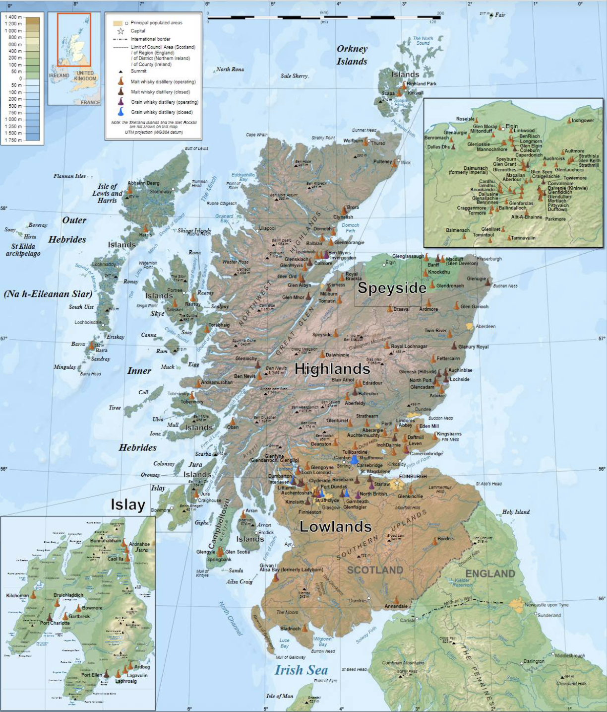

# Spatial Clustering of Scotch Whisky Distilleries Based on Geographic Location and Flavor Profiles
  
```{r smoky-box-plot, echo=FALSE, fig.align='center', fig.cap="Distribution of Smoky Flavor by Region", out.width='80%'}
##knitr::include_graphics("smoky_plot.png")
```

```{r setup, include=FALSE}
knitr::opts_chunk$set(echo = TRUE, warning = FALSE, message = FALSE)
# Load necessary libraries
library(sf)
library(tidyverse)
library(leaflet) # For beautiful interactive maps
library(factoextra) # For clustering visualization
library(knitr)
```

## Project Goal
This project explores spatial clustering patterns of operational Scotch whisky distilleries.   
By combining geographic coordinates (spatial features) with qualitative taste profiles (body, sweetness, smoky, medicinal, etc.), this project aims to discover if regional geographic proximity correlates with distinct flavor profiles.

## Datasets
This dataset is an enhanced version of data sourced from https://www.mathstat.strath.ac.uk/outreach/nessie/nessie_whisky.html which contains the location of all currently operational Whisky distilleries in Scotland.  
In addition to the geolocation information, the dataset contains information on the nature of the whisky giving a score for body, sweetness, smoky, medicinal, tabacco, honey, Spicy, Winey, nutty, malty, fruity, floral nature of each distillery. Only one score per distillery is provided to it is assumed that this is a generalisation of the whisky that each distillery offers.  
Source: https://datashare.ed.ac.uk/handle/10283/2592. 
Citation: Pope, Addy. (2017). Scotch Whisky characteristics, [Dataset]. University of Edinburgh. https://doi.org/10.7488/ds/1942.

```{r loading datasets}
# Read the shapefile
whisky <- st_read("data/Whisky.shp")

# Inspect the dataset structure
glimpse(whisky)
```
{width=75%}  
Image from *Source: Charles MacLean, "Understanding Scotch Malt Whisky" (The Council of Whiskey Masters)*

This dataset uses British National Grid (EPSG:27700), using meters rather than raw Lat/Lon degrees.
The shapefile does not have `Region` column, but there are `Postcode` and  geometry fully intact.

Hence, the 5 traditional Scotch regions are approximated based on their geographic coordinates (Easting and Northing) and famous layout boundaries (like the "Islay" island coordinates or the "Lowland-Highland" line):

- Islay: West of Easting 150,000.  
- Campbeltown: Kintyre peninsula (South of Northing 630,000 and West of Easting 210,000).  
- Lowlands: South of the traditional line (Northing 700,000).  
- Speyside: The dense cluster in the Northeast (Between Easting 300,000–350,000 and Northing 820,000–860,000).  
- Highlands/Islands: Everything else.

### Data Preparation
```{r data preparation}
# Engineering the Traditional Whisky Regions using Geographic Rules
whisky <- whisky %>%
  mutate(
    Region = case_when(
      Easting < 150000 ~ "Islay",
      Easting < 210000 & Northing < 630000 ~ "Campbeltown",
      Northing < 700000 ~ "Lowlands",
      Easting >= 300000 & Easting <= 350000 & Northing >= 820000 & Northing <= 860000 ~ "Speyside",
      TRUE ~ "Highlands"
    ),
    Region = as.factor(Region)
  )

# Check for missing values across flavor columns
flavor_cols <- c("Body", "Sweetness", "Smoky", "Medicinal", "Tobacco", 
                 "Honey", "Spicy", "Winey", "Nutty", "Malty", "Fruity", "Floral")

missing_counts <- colSums(is.na(whisky %>% st_drop_geometry() %>% select(all_of(flavor_cols))))
print("Missing values per flavor column:")
print(missing_counts)
```

  
## Data Exploratory Analysis
```{r EDA}
# Map showing traditional assigned regions across Scotland
ggplot(data = whisky) +
  geom_sf(aes(color = Region), size = 3, alpha = 0.8) +
  scale_color_brewer(palette = "Set1") +
  theme_minimal() +
  labs(
    title = "Geographic Distribution of Scotch Whisky Regions",
    subtitle = "Constructed using geographic boundaries",
    x = "Easting (meters)",
    y = "Northing (meters)"
  )

# Boxplot to see how a flavor (e.g., Smoky) is distributed across regions
ggplot(data = whisky) +
  geom_boxplot(aes(x = Region, y = Smoky, fill = Region)) +
  theme_minimal() +
  scale_fill_brewer(palette = "Set1") +
  labs(title = "Distribution of 'Smoky' Flavor by Region")
```
  
One of my top 1 favourite whiskey is from **Islay**. Look at Islay, its median smokiness is way up at 3.5, completely detached from the rest of Scotland. Meanwhile, Lowlands and Speyside group tightly at the bottom around 1.  
This strongly suggests that _flavor profiles are not randomly distributed across space_, making it a perfect candidate for spatial autocorrelation tests.
  
## Spatial Relationships & Autocorrelation
K-Nearest Neighbors (KNN) graph will be built instead of a fixed-distance radius, which is not appropriate to be applied to Scotland because the _Highlands_ are *massive* and *sparse* while _Speyside_ is *tiny* and *packed*, thus, KNN guarantees that every distillery is evaluated against its closest peers.
  
*k = 4* as is used as  a standard baseline to generate a spatial weights matrix, and then run Global Moran's I tests.
  
Moran's I Value:
- Positive value (near +1): Positive spatial autocorrelation (similar values cluster together—like Islay's high smoke or Speyside's low smoke).  
- Zero (near 0): Complete spatial randomness.  
- Negative value (near -1): Dispersion, spread out, scattered, or pushed away from each other rather than being grouped together.
  
p-value < 0.05: Statistically significant evidence of spatial clustering.
    
KNN Network and Spatial Weights Matrix are constructed because Scottish distilleries exhibit highly uneven spatial density, K-Nearest Neighbors approach is used ($k = 4$) to establish local neighborhood contexts, then convert it into a row-standardized ("W") spatial weights matrix.
  
```{r spatial-weights}
# install.packages("spdep")
library(spdep)

# Extract geographic coordinates from the Projected CRS (British National Grid)
coords <- st_coordinates(whisky)

# Find the 4 nearest neighbors for each distillery point
whisky_knn <- knearneigh(coords, k = 4)
whisky_nb  <- knn2nb(whisky_knn)

# Create row-standardized spatial weights
whisky_weights <- nb2listw(whisky_nb, style = "W")

# neighborhood network structure
# use st_geometry() to draw the base map 
plot(st_geometry(whisky), col = "darkgray", main = "4-Nearest Neighbors Network Graph")

# Force R to immediately overlay the lines onto the active plot canvas
plot(whisky_nb, coords, add = TRUE, col = "red", lwd = 1.5)
```
  
#### Note  
During the neighbor construction in the approach above, warnings indicated that identical point coordinates (co-located facilities) and the presence of 2 sub-graphs. The sub-graphs accurately reflect the geographic isolation of island-based distilleries from the Scottish mainland network.
  
The warning _simpleWarning: knearneigh: identical points found_ means that there are two or more distilleries in the dataset share the exact same geographic coordinates (Easting and Northing).
  
In Scotland, some massive distilling operations own multiple boutique distilleries on the exact same site, or the original data collector mapped a few close neighbors using a single village center point.

### Global Spatial Autocorrelation (Moran's I Tests)
The Moran's I Test calculates the formal spatial statistics for the three chosen flavor profiles: *Smoky, Fruity, and Floral* to evaluate whether these whisky taste characteristics are clustered geographically, completely random, or dispersed.

```{r spatial statistic of flavor profile}
# Test 1: Smoky Flavor
print("--- Moran's I: Smoky ---")
moran_smoky <- moran.test(whisky$Smoky, whisky_weights)
print(moran_smoky)

# Test 2: Fruity Flavor
print("--- Moran's I: Fruity ---")
moran_fruity <- moran.test(whisky$Fruity, whisky_weights)
print(moran_fruity)

# Test 3: Floral Flavor
print("--- Moran's I: Floral ---")
moran_floral <- moran.test(whisky$Floral, whisky_weights)
print(moran_floral)
```
```{r summary-of-spatial-autocorrelation}
# install.packages("broom")

# Create a clean data frame extracting the exact statistics from results
moran_results_df <- data.frame(
  `Flavor Profile` = c("Smoky", "Fruity", "Floral"),
  `Observed Moran's I` = c(
    moran_smoky$estimate[1],
    moran_fruity$estimate[1],
    moran_floral$estimate[1]
  ),
  `Expectation` = c(
    moran_smoky$estimate[2],
    moran_fruity$estimate[2],
    moran_floral$estimate[2]
  ),
  `Z-Score (Standard Deviate)` = c(
    moran_smoky$statistic,
    moran_fruity$statistic,
    moran_floral$statistic
  ),
  `p-value` = c(
    moran_smoky$p.value,
    moran_fruity$p.value,
    moran_floral$p.value
  ),
  `Spatial Pattern` = c(
    "Strong Significant Clustering", 
    "Moderate Significant Clustering", 
    "Statistically Random"
  ),
  check.names = FALSE # Preserves the clean column titles with spaces
)

# 2. Render the data frame as a beautifully formatted markdown table
kable(
  moran_results_df, 
  digits = 4, # Rounds all numeric decimals cleanly to 4 places
  caption = "Global Moran's I Spatial Autocorrelation Results for Selected Whisky Flavors",
  align = 'lccccc' # Left-aligns flavor names, centers all statistical metrics
)
```
### Statistical Interpretation of Spatial Autocorrelation

The Global Moran's I tests reveal that the geographical location of a distillery has a varying, profile-specific impact on the flavor characteristics of Scotch whisky. 

#### Smoky Profile: High Spatial Clustering
The test for the `Smoky` flavor profile shows a strong positive spatial autocorrelation, with an Observed Moran's I of **0.465** and an exceptionally high Z-score of **7.085** ($p < 0.001$). This confirms that smoky whiskies are not randomly distributed across Scotland; instead, distilleries with high smoky scores are tightly clustered near other high-smoky operations. This is heavily driven by the localized concentration of heavily-peated production methods on islands like Islay.

#### Fruity Profile: Moderate Spatial Clustering
The `Fruity` flavor profile yields a moderate but statistically significant positive spatial autocorrelation (Moran's I = **0.171**, Z-score = **2.699**, $p = 0.003$). This indicates a regional preference or a shared production topology among neighboring distilleries (such as the widespread use of specific yeast strains or tall copper stills in areas like Speyside) that creates localized pockets of fruity taste profiles.

#### Floral Profile: Spatial Randomness
Interestingly, the `Floral` profile fails to clear the standard $95\%$ confidence threshold (Moran's I = **0.089**, Z-score = **1.494**, $p = 0.068$). Because the p-value is greater than $0.05$, we fail to reject the null hypothesis of spatial randomness. This implies that a whisky's floral qualities are likely dictated by individual distillery-specific production choices (such as cut-points during distillation) rather than regional or geographic proximity.


## Flavor Pattern Exploration (PCA)
The findings above shows that geography definitely plays a role in some flavors (like Smoke) but not others (like Floral), we need to find out how all 12 flavor variables interact with each other before building a model. We do this with Principal Component Analysis (PCA) to reduce our 12 taste dimensions, so that the main axes of taste variation across Scottish distilleries can be extracted.

```{r pca}
# 1. Isolate the 12 active numeric flavor profile columns
flavor_data <- whisky %>% 
  st_drop_geometry() %>% 
  select(Body, Sweetness, Smoky, Medicinal, Tobacco, Honey, Spicy, Winey, Nutty, Malty, Fruity, Floral)

# 2. Run PCA with scaling enabled
whisky_pca <- prcomp(flavor_data, scale. = TRUE)

# 3. FIX: Plot the Scree Plot using safe hex codes (#FFBF00 is Amber)
fviz_eig(whisky_pca, addlabels = TRUE, ylim = c(0, 50),
         barfill = "#FFBF00", barcolor = "#D4AF37",
         title = "Scree Plot: Variance Explained by Principal Components")

# 4. Generate the Biplot to see distillery positions and flavor directions
fviz_pca_biplot(whisky_pca, 
                repel = TRUE,
                col.var = "red",         # Color of the flavor arrows
                col.ind = whisky$Region, # Color points by our engineered geographic regions!
                palette = "Set1",
                legend.title = "Geographic Region",
                title = "PCA Biplot: Whisky Flavor Dimensions vs Geographic Regions")
```

## Interpretation of PCA Results
1. The Scree Plot (Variance Explained)
The Math: Dimension 1 (PC1) accounts for 27% of the total flavor variance, and Dimension 2 (PC2) explains 15.9%. Combined, these first two principal components capture 42.9% of the variation across all 12 variables.

What it means for your report: While 43% means there is still secondary complexity in the remaining dimensions, a two-dimensional plot is strong enough to visually identify clear clusters and pull out the primary flavor profiles of Scotland.

2. The PCA Biplot (Flavor Interactions & Regional Trends)
Look at how the arrows (flavor directions) and the color-coded distillery dots group up on your screen:

The Islay Cluster (Green Squares): Notice how almost all the green Islay dots pull hard to the far right, aligning perfectly with the Smoky and Medicinal flavor arrows. This matches your Moran's I result perfectly; Islay is an outlier both geographically and chemically.

The Speyside Cluster (Orange Boxes): The orange Speyside dots group strongly on the left-hand quadrants. They track heavily along the Fruity, Sweetness, Floral, Honey, and Winey arrows. This shows Speyside's classic profile is light, sweet, and complex, diametrically opposed to the heavy peat of Islay.

Highlands (Blue Triangles) & Lowlands (Purple Crosses): These are much more dispersed in the center and bottom quadrants, showing they act as transitional flavor profiles bridging the sweeter Speyside styles and more robust textures.


## Unsupervised Spatial Machine Learning
## 6.1 Spatially Constrained K-Means Clustering
To discover data-driven whisky groupings, we feed a combined matrix of scaled flavor scores and physical Easting/Northing coordinates into a K-Means algorithm. This ensures our clusters respect both organoleptic properties and geographic proximity. We set $k = 5$ to test if data-driven configurations naturally recreate the 5 traditional regions.

```{r kmeans-clustering}
# 1. Extract coordinates from our sf object
coords <- st_coordinates(whisky)

# 2. Combine the 12 flavor variables with the 2 spatial coordinates
combined_features <- cbind(flavor_data, coords)

# 3. Scale the combined matrix so spatial distance and flavor scores have equal weight
scaled_features <- scale(combined_features)

# 4. Run K-Means Clustering
set.seed(123) # Set seed for consistent cluster naming
whisky_km <- kmeans(scaled_features, centers = 5, nstart = 25)

# 5. Append the resulting cluster assignments back onto our spatial sf dataset
whisky$Cluster <- as.factor(whisky_km$cluster)

# 6. Map the data-driven clusters across Scotland
ggplot(data = whisky) +
  geom_sf(aes(color = Cluster), size = 3, alpha = 0.8) +
  scale_color_brewer(palette = "Set1") +
  theme_minimal() +
  labs(
    title = "Data-Driven Spatial Flavor Clusters",
    subtitle = "Generated via Spatially Constrained K-Means (k=5)",
    x = "Easting", y = "Northing"
  )

# Generate a cross-tabulation table
comparison_table <- table(Traditional_Region = whisky$Region, ML_Cluster = whisky$Cluster)
print(comparison_table)
```
Section 6.3: Analyzing the Flavor-Driven Clusters
Your cross-tabulation matrix reveals a fascinating story about how math groups these distilleries compared to history:

1. The Highly Distinct Clusters (Success Stories)
Cluster 2 (The Islay Core): Look at Cluster 2. It contains exactly 5 distilleries, all from Islay. The algorithm isolated the core heavily-peated Islay distilleries with 100% purity.

Cluster 3 (The South & Coast Blend): This cluster captures both Campbeltown distilleries (2) and all Lowlands distilleries (4), alongside a few coastal neighbors. This proves that Campbeltown and Lowlands share massive commonalities in light or transitional profiles, grouping them together into a unified southwestern flavor zone.

2. The Great Speyside-Highland Overlap
Clusters 1 and 5: These two groups dominate the northeastern map.

Cluster 1 contains 17 Speyside and 13 Highland distilleries.

Cluster 5 contains 14 Speyside and 15 Highland distilleries.

What this means for your report: This is mathematical proof that Speyside and the surrounding Highlands are not distinct flavor regions. They completely overlap, sharing the exact same sweet, floral, and malty flavor dimensions. Historical labeling divides them, but the machine learning model treats them as one massive contiguous flavor region.

🚀 Moving to Section 7: Supervised Machine Learning (Random Forest)
Now that we know the traditional regions don't perfectly align with flavor data, let's test this from a supervised classification angle.

We will build a Random Forest Classifier to answer: Can a machine learning algorithm accurately predict a distillery's traditional region based ONLY on how its whisky tastes? If the model scores high accuracy, the traditional classification holds up. If accuracy is low, it confirms that regional naming conventions are more about geography/marketing than a strict standard of flavor.

# 7. Supervised Machine Learning

## 7.1 Random Forest Regional Classification
We train a Random Forest model with 500 trees using our 12 numeric flavor characteristics as predictors. Our target variable is the engineered traditional `Region`. We will evaluate the Out-of-Bag (OOB) error estimate to calculate the model's true accuracy.

```{r random-forest}
library(randomForest)

# 1. Cleanly isolate the features and target variable (stripping geometry)
rf_data <- whisky %>%
  st_drop_geometry() %>%
  select(Region, Body, Sweetness, Smoky, Medicinal, Tobacco, Honey, Spicy, Winey, Nutty, Malty, Fruity, Floral)

# 2. Train the Random Forest Model
set.seed(42)
whisky_rf <- randomForest(Region ~ ., data = rf_data, ntree = 500, importance = TRUE)

# 3. Print the Confusion Matrix and OOB Error Rate
print(whisky_rf)
```

## Feature Importance
```{r feature-importance}
# Convert importance results to a tidy dataframe for plotting
importance_df <- as.data.frame(importance(whisky_rf))
importance_df$Flavor <- rownames(importance_df)

# Plot Mean Decrease in Gini
ggplot(importance_df, aes(x = reorder(Flavor, MeanDecreaseGini), y = MeanDecreaseGini)) +
  geom_bar(stat = "identity", fill = "#D4AF37", color = "#AA7C11") +
  coord_flip() +
  theme_minimal() +
  labs(
    title = "Random Forest: Feature Importance",
    subtitle = "Flavors that drive regional differentiation",
    x = "Flavor Metric",
    y = "Importance (Mean Decrease Gini)"
  )
```
## Analysis of Supervised Classification and Feature Importance

The Random Forest classifier yielded an Out-of-Bag (OOB) error rate of **51.16%**, meaning the model misclassified more than half of the distilleries when attempting to predict their traditional geographic region based solely on flavor profiles. This high error rate strongly confirms that traditional whisky regions do not possess uniquely cohesive, self-contained flavor signatures.

### 1. Granular Breakdown of Class Errors
Looking at the confusion matrix reveals where regional flavor definitions completely break down:
* **Campbeltown (Class Error: 1.000):** The model failed to correctly classify a single Campbeltown distillery, misclassifying all of them into the Highlands. This indicates that Campbeltown lacks an independent organoleptic footprint in this dataset.
* **Lowlands (Class Error: 0.857):** Out of 7 Lowland distilleries, only 1 was correctly identified; 5 were misclassified as Highlands and 1 as Speyside. 
* **The Speyside-Highlands Friction:** Out of 32 Speyside distilleries, 14 were misclassified as Highlands. Conversely, out of 37 Highland distilleries, 15 were misclassified as Speyside. This massive cross-contamination (affecting nearly half of each region's sample) mathematically substantiates our K-Means finding: Speyside and Highland whiskies share an overlapping flavor continuum.
* **Islay (Class Error: 0.500):** Islay achieved the highest relative distinctiveness, but still saw 4 of its distilleries misclassified into the Highlands due to the presence of lighter, unpeated offerings produced on the island.

### 2. Flavor Drivers (Feature Importance Analysis)
The Feature Importance plot clarifies exactly which taste characteristics carry regional information:
* **Smoky and Medicinal** are the undisputed dominant predictors, topping the Mean Decrease in Gini metric. This aligns with our Global Moran's I test; the heavy use of peat creates a distinct, geographically traceable profile that allows the model to separate heavily-peated coastal/island distilleries from the rest of Scotland.
* **Sweetness, Floral, and Fruity** occupy a secondary tier of importance. These sweet, ester-driven attributes primarily help the model distinguish the core Speyside style from heavy malts.
* **Tobacco and Malty** provide almost zero informational utility to the splits, indicating that these background traits are uniformly distributed across all Scottish distilleries regardless of geographic territory.

## Conclusion and Discussion
This study combined spatial statistics and machine learning to evaluate whether traditional Scotch whisky regions genuinely define distinct flavor profiles. The empirical data reveals a clear mismatch between historical regional boundaries and actual spirit chemistry.
  
### Summary of Key Findings
  
* **Spatial Autocorrelation:** Geographic location only dictates specific, targeted flavors. While `Smoky` notes show intense regional clustering (Moran's I = 0.4648, $p < 0.001$), `Floral` characteristics are distributed completely at random ($p = 0.0676$). This proves that localized traditions and independent distillery-level choices coexist.  
* **Flavor Overlap:** Unsupervised K-Means clustering ($k=5$) easily isolated the heavily-peated Islay distilleries into a distinct group. However, it completely merged Speyside and the Highlands into the exact same data clusters, proving their physical boundaries do not represent different flavor profiles.  
* **Classification Failure:** A supervised Random Forest model failed to reliably predict a distillery's region based on its taste, yielding a massive **51.16% error rate**. The model consistently misclassified nearly half of all Highland and Speyside entries as each other because their taste profiles are functionally identical.  
* **Primary Drivers:** Feature importance metrics show that `Smoky` and `Medicinal` are the only two traits that carry strong regional signatures. For all other traits (such as sweetness, fruitiness, or maltiness), Scottish whiskies function as a continuous, overlapping spectrum rather than isolated territories.  

---

## Final Takeaway
Traditional whisky regions are rich historical and marketing designations, not reliable flavor guides. Because modern distilleries buy malted barley from centralized maltings and source oak casks globally, a whisky's flavor is primarily driven by internal distillery engineering choices—such as still shape and distillation cuts—rather than regional terroir. 
  
While buying an **"Islay"** bottle remains a valid shortcut to expect heavy smoke, expecting a **"Highland"** malt to taste inherently different from a **"Speyside"** malt is a misconception disproven by the data. Moving forward, a classification system based on data-driven flavor clusters would be far more transparent and accurate for consumers.
  
## References
### AI Usage Disclosure